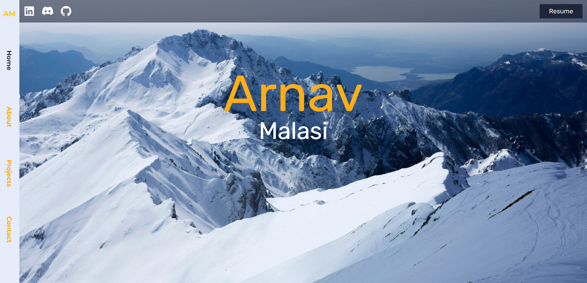

# My Personal Portfolio Website
Thank you for visiting my personal portfolio, with the short time you are here I hope you can learn a bit more about me!

[Click here]() to check it out!

## **Tools used:** NextJS, React, JavaScript, TailwindCSS, MongoDB

## **Dependencies Used:** 
- GSAP
- Framer Motion
- ThreeJS
- Mongoose
- Intersection Observer
- (for deployment)

## Key Features

### 1. About section
Delve into the "About" section to acquaint yourself with me and effortlessly download my resume with just a click.

### 2. Projects section
Descend into the "Projects" section to behold the fruits of my labor, what I have to offer, and my unlimited potential.

### 3. Database connectivity with MongoDB in Contact section
Navigate to the "Contact" section to effortlessly reach out to me. The contact form is seamlessly enabled by Atlas, ensuring the seamless delivery of your messages.

If you visit my website, please don't forget to leave a message to me through the contact section!

Thank you for visiting, and I look forward to connecting with you!